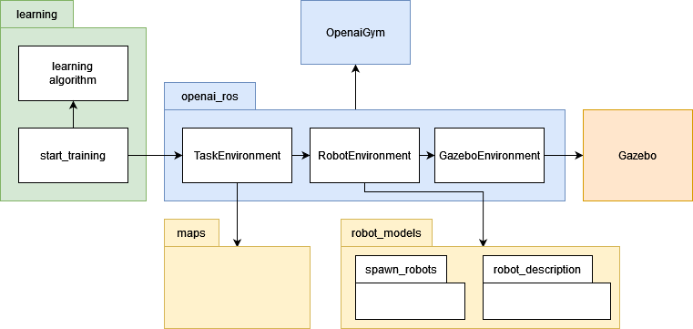

# gazebo_openai_tool
This work builds on the [openai_ros package](http://wiki.ros.org/openai_ros).

-----

**`gazebo_openai_tool` is a structure of packages which works with [Gazebo simulator](http://gazebosim.org/) and [OpenaAI Gym](https://gym.openai.com/). It puts together simulation tools, robot middlewares, machine learning and reinforcement learning to create an environment which is easy to set up and to expand. The goal is to give people who are new to robotics and machine learning an out of the box application to test there learning algorithms.**

**Code is available "as it is" and is not supported by any specific organization.**

-----
## Table of Contents
- [Environments](#environments)
- [Setup](#setup)
- [Usage](#usage)

## Environments
The environment is structured into four parts: openai_ros, learning, maps and robot_models.



### openai_ros
`openai_ros` is then core of `gazebo_openai_tool`.
It is a package structure provided and maintained by [TheConstruct](https://www.theconstructsim.com/). It makes it easy to use OpenAI with ROS and Gazebo.
The structure of openai_ros can be divided in 3 parts: GazeboEnvironment, RobotEnvironment and TaskEnvironment.

GazeboEnvironment inherits from the Gym Environment from OpenAI and is mainly used to connect the simulated environment to the Gazebo simulator.

RobotEnvironment inherits from the GazeboEnvironment and uses the `robot_models` package to load and spawn robots into the gazebo world. A new robot enviroment is needet for every new robot that is implemented

TaskEnvironment inherits from the RobotEnvironment und uses the `maps` package to load the world in which the robot should navigate and learn. It also defines what the task that the robot should fulfill. Task environments are made for specific robot environments. A new task environment is needet for every new robot and every new task.

For more detailed information see [Website](http://wiki.ros.org/openai_ros), [Source](https://bitbucket.org/theconstructcore/openai_ros.git), [API documentation](https://theconstructcore.bitbucket.io/openai_ros/index.html)

### learning
`learninig` is the only package which users should need to interact with, given that tasks and robots are implemented completely.
Here you select the task and robot to be used and set up the learning algorithm that you want to use in order to make your agent learn.

The training scripts are totally independent from the environments. So you can change the training script without modifying your environments structure.

### maps
`maps` package is used to store all assets which are needed for the `task environments` of `openai_ros`. This includes course design, obstacles and traffic lights.
It is structured in a way that the `task environment` only has to use one launch file to load the whole map and all assets in it.

Implemented maps are:
TODO

### robot_models
`robot_models` is used to store all robot related packages like robot descriptions and sensors.
It is structured in a way that the `robot environment` of `openai_ros` only has to use one launch file to load a robot and all its sensors and dependencies.

Implemented robots are:
Turtlebot3

## Setup
### Installation
Ubuntu 20.04

Update Ubuntu and install curl
```bash
sudo apt-get update
```
```bash
sudo apt-get upgrade -y
```
```bash
sudo apt update
```
```bash
sudo apt upgrade -y
```

Install ROS Noetic (source: http://wiki.ros.org/noetic/Installation/Ubuntu)
```bash
sudo apt-get install curl
```
```bash
sudo sh -c 'echo "deb http://packages.ros.org/ros/ubuntu $(lsb_release -sc) main" > /etc/apt/sources.list.d/ros-latest.list'
```
```bash
curl -s https://raw.githubusercontent.com/ros/rosdistro/master/ros.asc | sudo apt-key add -
```
```bash
sudo apt-get update
```
```bash
sudo apt-get upgrade -y
```
```bash
sudo apt update
```
```bash
sudo apt upgrade -y
```
```bash
sudo apt-get install ros-noetic-desktop-full -y
```
```bash
source /opt/ros/noetic/setup.bash
```
```bash
echo "source /opt/ros/noetic/setup.bash" >> ~/.bashrc
```
```bash
source ~/.bashrc
```
```bash
sudo apt install python3-rosdep python3-rosinstall python3-rosinstall-generator python3-wstool build-essential -y
```
```bash
sudo apt install python3-rosdep -y
```
```bash
sudo rosdep init
```
```bash
rosdep update
```
```bash
rosdep update --include-eol-distros
```
```bash
sudo apt-get install ros-noetic-gazebo-ros-pkgs ros-noetic-gazebo-ros-control -y
```

Create catkin workspace (source: http://wiki.ros.org/catkin/Tutorials/create_a_workspace)
```bash
mkdir -p ~/catkin_ws/src
```
```bash
cd ~/catkin_ws/src
```
```bash
catkin_init_workspace
```
```bash
cd ~/catkin_ws
```
```bash
catkin_make
```
```bash
source ~/catkin_ws/devel/setup.bash
```
```bash
echo "source ~/catkin_ws/devel/setup.bash" >> ~/.bashrc
```
```bash
cd ~/catkin_ws/src
```
```bash
sudo apt-get install python3-pip -y
```
```bash
pip3 install --ignore-installed tensorflow gym wandb
```
Download GIT Repository
```bash
git clone https://github.com/NicoV1994/gazebo_openai_tool.git
```
```bash
cd ~/catkin_ws
```
```bash
catkin_make
```

Intall more catkin packages
```bash
sudo apt-get install ros-noetic-joy ros-noetic-teleop-twist-joy ros-noetic-teleop-twist-keyboard ros-noetic-laser-proc ros-noetic-rgbd-launch ros-noetic-rosserial-arduino ros-noetic-rosserial-python ros-noetic-rosserial-client ros-noetic-rosserial-msgs ros-noetic-amcl ros-noetic-map-server ros-noetic-move-base ros-noetic-urdf ros-noetic-xacro ros-noetic-compressed-image-transport ros-noetic-rqt* ros-noetic-rviz ros-noetic-gmapping ros-noetic-navigation ros-noetic-interactive-markers ros-noetic-cv-bridge ros-noetic-vision-opencv python3-opencv libopencv-dev ros-noetic-image-proc -y
```
```bash
rosdep install --from-paths ~/catkin_ws --ignore-src --rosdistro=noetic
```

Change permission for python scripts
```bash
chmod +x ~/catkin_ws/src/gazebo_openai_tool/learning/scripts/.
```

Add alias killgazebogym
```bash
echo "alias killgazebogym='killall -9 rosout roslaunch rosmaster gzserver nodelet robot_state_publisher gzclient'" >> ~/.bashrc
```

### Docker
TODO

## Usage
To use the Tool you have to run the start_training launch file from the learning folder.
```bash
roslaunch learning start_training_wl_lr_course1_turtlebot3.launch
```

TODO
